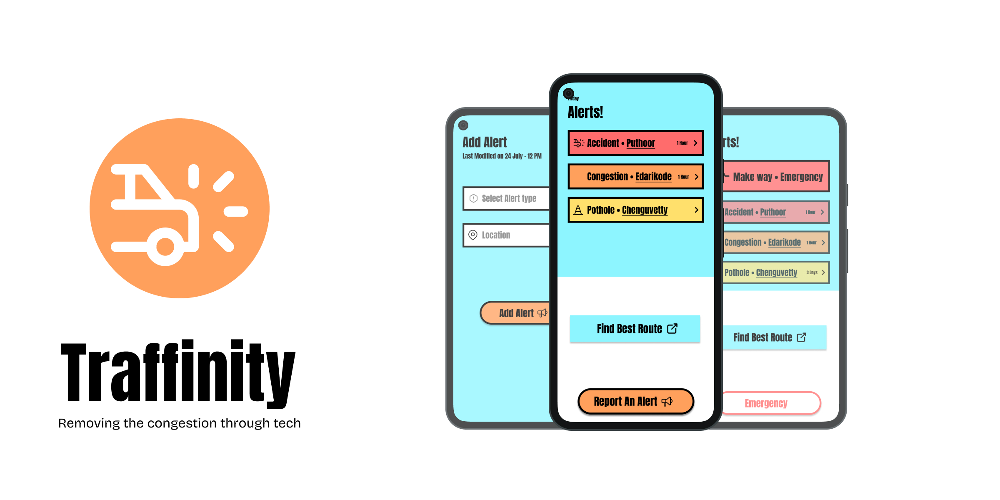

# 🚦 Traffinity

Traffinity is a mobile-first digital solution to traffic stress by providing you with realtime congestion, accident & emergency alert helping both the common people and emergency service providers.

## ✨ Features
### 👤 Normal User
- View real-time alerts (Accidents, Congestion, Potholes)
- Report new alerts with type & location
- Edit/Mark alerts as resolved
- Get smart route suggestions (coming soon)

### 🚑 Emergency Service (Ambulance)
- View all alerts with high-priority tags
- Use the Emergency button to:
- Highlight presence: Trigger “🚨 Make Way” alerts for others

## 🏗️ Tech Stack
- Frontend: Flutter
- Backend: Node.js + Express & Socket.io
